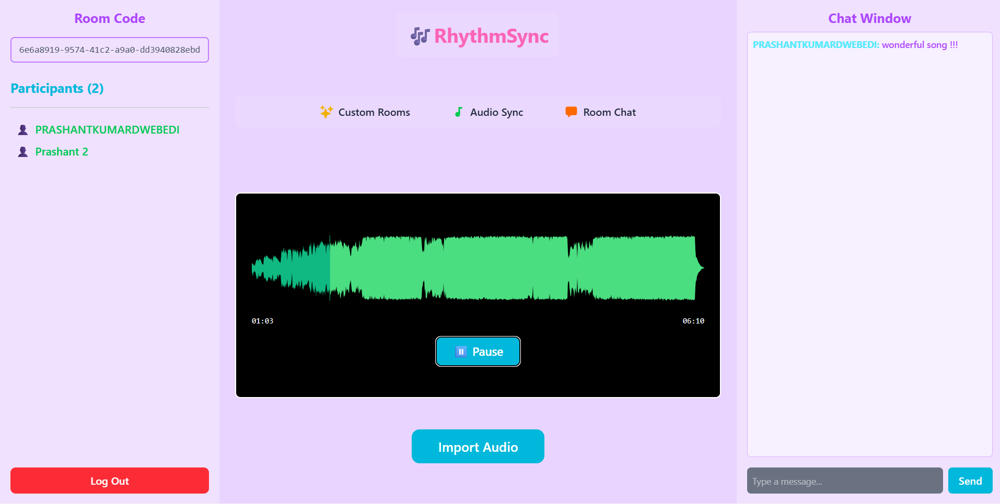
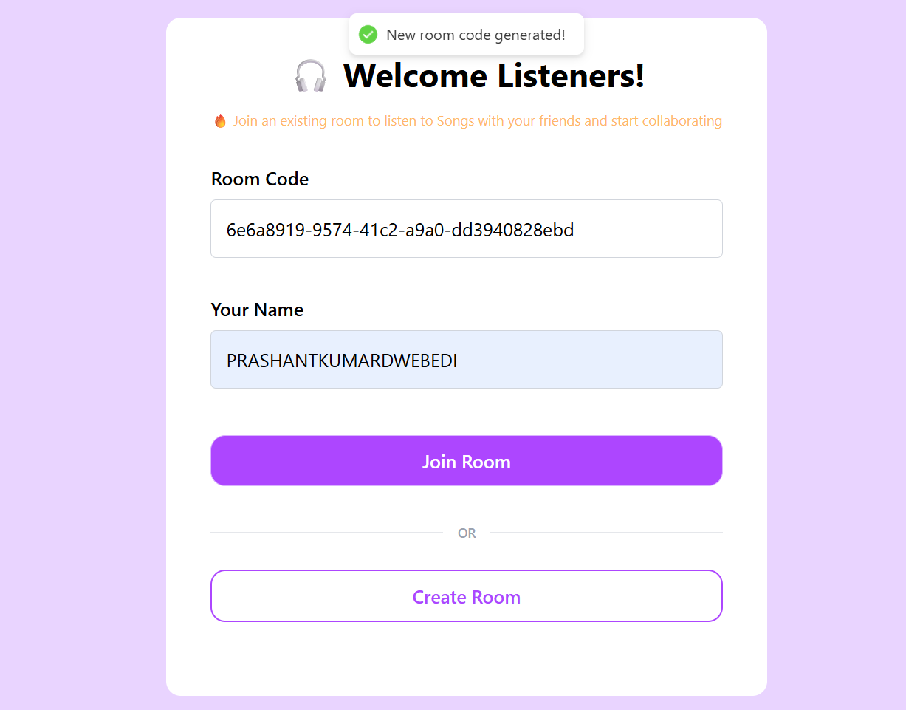
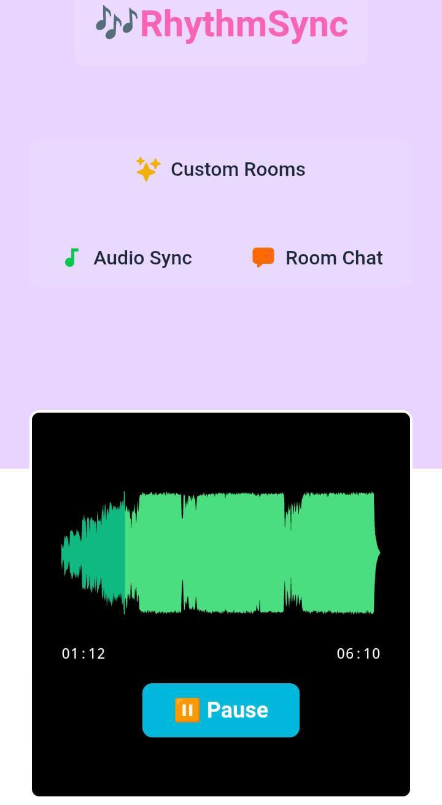

# 🎶 RhythmSync - Real-Time Audio Synchronization Platform

<div align="center">
  

  [](https://audiosync-frontend.vercel.app)
  
</div>

## 🌟 Overview

**RhythmSync** is a cutting-edge real-time audio synchronization platform that enables multiple users to listen to music together in perfect sync, regardless of their location. Built with modern web technologies, it provides seamless audio streaming with instant chat functionality and real-time participant management.

## ✨ Features

### 🎵 **Real-Time Audio Sync**
- Perfect audio synchronization across all connected devices
- Support for multiple audio formats (MP3, WAV, FLAC, etc.)
- Real-time play/pause/seek controls shared among all participants

### 👥 **Multi-User Rooms**
- Create and join custom rooms with unique room codes
- Live participant tracking and management
- User-friendly room sharing system

### 💬 **Instant Chat**
- Real-time messaging within audio rooms
- Beautiful chat interface with user identification
- Message history preservation during sessions

### 📱 **Responsive Design**
- Fully optimized for desktop and mobile devices
- Beautiful glassmorphism UI design
- Touch-friendly controls for mobile users

## 🖼️ Screenshots

### Desktop Experience
<div align="center">
  
  <p><em>Elegant room creation interface</em></p>
</div>

<div align="center">
  
  <p><em>Full-featured desktop interface with three-panel layout</em></p>
</div>

### Mobile Experience
<div align="center">
  
  <p><em>Responsive mobile design with intuitive navigation</em></p>
</div>

## 🚀 Tech Stack

### Frontend
- **React.js** - Modern UI framework
- **Vite** - Lightning-fast build tool
- **Tailwind CSS** - Utility-first CSS framework
- **WaveSurfer.js** - Audio waveform visualization
- **Socket.IO Client** - Real-time communication
- **React Router** - Client-side routing
- **Axios** - HTTP client for API calls

### Backend
- **Node.js** - Server runtime
- **Express.js** - Web application framework
- **Socket.IO** - Real-time WebSocket communication
- **MongoDB** - NoSQL database with Mongoose ODM
- **Cloudinary** - Cloud-based audio file storage
- **CORS** - Cross-origin resource sharing

### Deployment
- **Frontend**: Vercel (CDN + Static hosting)
- **Backend**: Render (Container hosting with WebSocket support)
- **Database**: MongoDB Atlas (Cloud database)
- **Storage**: Cloudinary (Audio file management)

## 🛠️ Installation & Setup

### Prerequisites
- Node.js (v18 or higher)
- npm or yarn package manager
- MongoDB Atlas account
- Cloudinary account

### 1. Clone the Repository
```bash
git clone https://github.com/yourusername/rhythmsync.git
cd rhythmsync
```

### 2. Backend Setup
```bash
cd backend
npm install
```

Create `.env` file in backend directory:
```env
CLOUD_NAME=your_cloudinary_cloud_name
API_KEY=your_cloudinary_api_key
API_SECRET=your_cloudinary_api_secret
MONGO_URI=your_mongodb_connection_string
PORT=3000
```

Start the backend server:
```bash
npm run dev
```

### 3. Frontend Setup
```bash
cd ../frontend
npm install
```

Create `.env` file in frontend directory:
```env
VITE_API_URL=http://localhost:3000
```

Start the frontend development server:
```bash
npm run dev
```

## 🌐 Deployment

### Backend Deployment (Render)
1. Push your code to GitHub
2. Create a new Web Service on [Render](https://render.com)
3. Connect your GitHub repository
4. Set build command: `npm install`
5. Set start command: `npm start`
6. Add environment variables from your `.env` file

### Frontend Deployment (Vercel)
1. Install Vercel CLI: `npm install -g vercel`
2. Run `vercel` in the frontend directory
3. Follow the prompts to deploy
4. Update `VITE_API_URL` to your deployed backend URL

## 🎯 Usage

### Creating a Room
1. Visit the application homepage
2. Enter your username
3. Click "Create New Room"
4. Share the generated room code with friends

### Joining a Room
1. Enter your username
2. Input the room code shared by a friend
3. Click "Join Room"
4. Start enjoying synchronized audio!

### Audio Controls
- **Upload**: Import audio files (MP3, WAV, FLAC supported)
- **Play/Pause**: Control playback for all participants
- **Seek**: Jump to any position in the track
- **Chat**: Communicate with other participants in real-time

## 🔧 API Endpoints

| Method | Endpoint | Description |
|--------|----------|-------------|
| GET | `/` | Server status and health check |
| GET | `/signature` | Cloudinary upload signature |

### WebSocket Events

| Event | Description |
|-------|-------------|
| `join_room` | Join a specific room |
| `send_audio` | Share audio file with room |
| `send_message` | Send chat message |
| `request_to_play` | Request audio playback |
| `request_to_pause` | Request audio pause |
| `send_seek` | Seek to specific time |

## 🤝 Contributing

We welcome contributions! Please follow these steps:

1. Fork the repository
2. Create a feature branch: `git checkout -b feature/amazing-feature`
3. Commit your changes: `git commit -m 'Add amazing feature'`
4. Push to the branch: `git push origin feature/amazing-feature`
5. Open a Pull Request

## 🐛 Known Issues

- Audio sync might have slight delays on slower internet connections
- Large audio files (>100MB) may take longer to upload
- Safari requires user interaction before audio autoplay

## 📋 Roadmap

- [ ] Playlist management
- [ ] User accounts and room history
- [ ] Audio effects and equalizer
- [ ] Voice chat integration
- [ ] Mobile app development
- [ ] Spotify/Apple Music integration

## 📝 License

This project is licensed under the MIT License - see the [LICENSE](LICENSE) file for details.

## 👨‍💻 Author

**Prashant Kumar**
- GitHub: [@PrashantKumarD](https://github.com/PrashantKumarD)
- LinkedIn: [Your LinkedIn](https://linkedin.com/in/yourprofile)

## 🙏 Acknowledgments

- [WaveSurfer.js](https://wavesurfer-js.org/) for audio visualization
- [Socket.IO](https://socket.io/) for real-time communication
- [Cloudinary](https://cloudinary.com/) for media management
- [Tailwind CSS](https://tailwindcss.com/) for styling utilities

## 📞 Support

If you encounter any issues or have questions:
- Open an [issue](https://github.com/yourusername/rhythmsync/issues)
- Email: your.email@example.com

---

<div align="center">
  <strong>🎵 Experience music together with RhythmSync! 🎵</strong>
  
  [](https://vercel.com/new/clone?repository-url=https://github.com/yourusername/rhythmsync)
</div>
